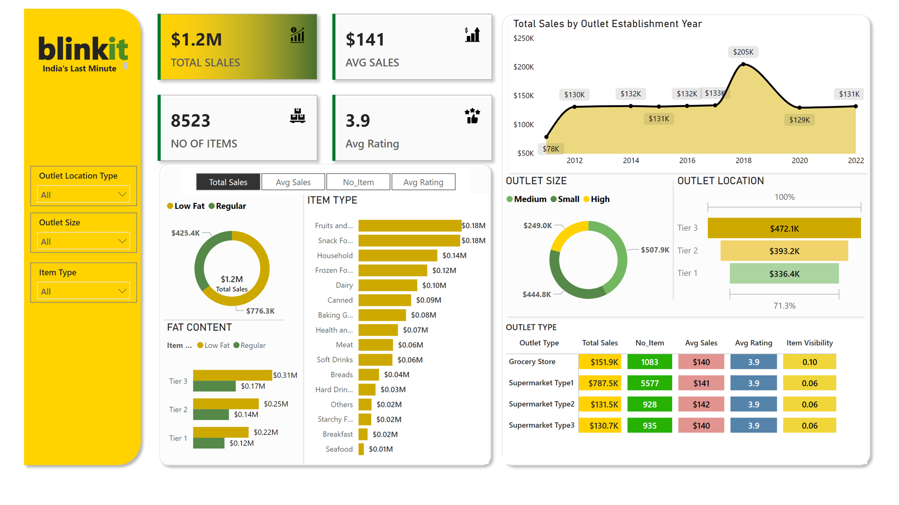

# Blinkit Sales Dashboard (Power BI)

This project is a **Power BI dashboard** created to analyze sales data for Blinkit (India's Last Minute).  
The dashboard provides insights into total sales, number of items, average sales, outlet size, outlet location, and item types.  

## 🚀 Features
- **Total Sales Analysis**: Track total revenue and average sales.
- **Outlet Performance**: Compare sales by outlet size, type, and establishment year.
- **Product Categories**: Analyze sales by item type (Fruits, Snacks, Dairy, Household, etc.).
- **Customer Insights**: View ratings and fat content distribution (Regular vs. Low Fat).
- **Interactive Filters**: Explore data by outlet location, size, and item type.

## 📊 Dashboard Preview

## 🛠 Tools Used
- **Power BI** for data visualization  
- **Data Cleaning & Modeling** using Power Query  

## 📌 Key Insights
- Highest sales came from **Supermarket Type1** outlets.  
- Tier 3 locations generated the largest revenue compared to Tier 1 and Tier 2.  
- Regular items contributed more sales compared to Low Fat products.  

---

✨ This is one of my Power BI projects, showcasing data cleaning, modeling, and visualization skills.
